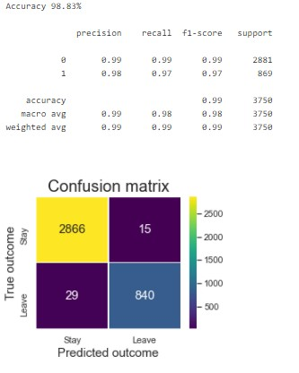
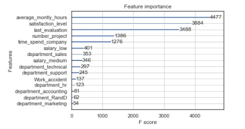
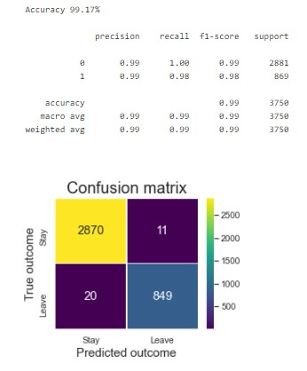

# Top-classifiers-for-Employee-attrition-problem
Explore various classifiers to predict which employee is likely to quit

In this notebook, the objective is to build a classifier able to identify which employee is likely to quit or not based on a set of features.
This is a rather simple dataset which allows to test a number of classifiers.

# Dataset

The dataset used comes from KAGGLE and can be found [here](https://www.kaggle.com/liujiaqi/hr-comma-sepcsv). It holds 15K employee records labelled as leavers or not.
In total, 9 features are available for our classification task.

# Best model

I test several classifiers from sklearn suite. Ensemble models generally perform much better than logisticRegression or SVM.
XG Boost obtains the best performance with an accuracy just below 99% and a very good f1-score. Very good recall reducing the issue of false negative which can be a significant flaw when trying to detect future leavers. Companies would want to avoid not detecting true leavers (false negative). This is the issue with most consequential impact.
Most influencing features are the workload, the employee's satisfaction level, the performance evaluation and the number of years of service with the company (decreasing order).

# Wrap-up

Using majority voting, the combination of XGBoost, Gradient Boosting and DecisionTree provides the highest performance with slightly above 99% accuracy.
From there we are able to predict if an employee is at risk or not based on employee profile and available corporate assessments.

